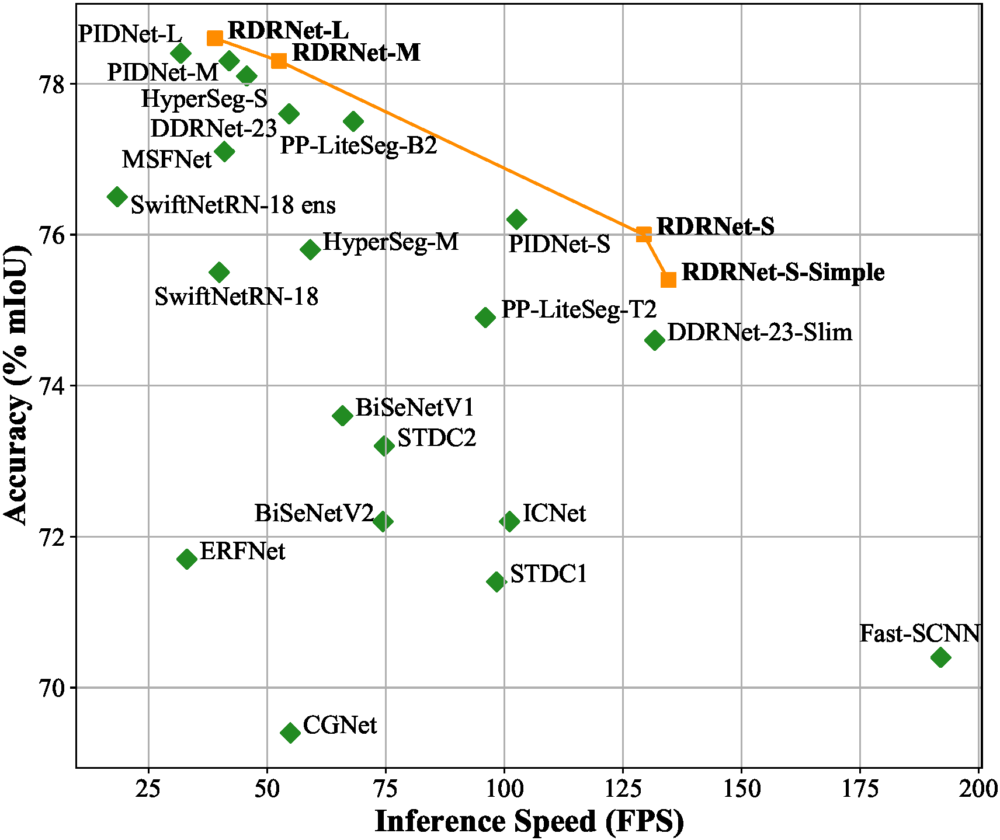

# Reparameterizable Dual-Resolution Network for Real-time Semantic Segmentation ([arXiv](https://arxiv.org/abs/2406.12496))

By Guoyu Yang, Yuan Wang, Daming Shi*

This project is based on [mmsegmentation](https://github.com/open-mmlab/mmsegmentation).


# Highlight

<p align="left">
  </br>
</p>
The trade-off between inference speed and accuracy for real-time semantic segmentation models on the Cityscapes test set.

# Experiment

## Environment
```
python==3.8.10
pytorch==1.12.1
torchvision==0.13.1
mmengine==0.7.3
mmcv==2.0.0
mmsegmentation==1.0.0
```

## Install
Please refer to [mmsegmentation](https://mmsegmentation.readthedocs.io/en/latest/get_started.html) for installation.

## Dataset
```
RDRNet
├── mmsegmentation
├── figures
├── data
│   ├── cityscapes
│   │   ├── leftImg8bit
│   │   │   ├── train
│   │   │   ├── val
│   │   ├── gtFine
│   │   │   ├── train
│   │   │   ├── val
│   ├── CamVid
│   │   ├── train
│   │   ├── train_labels
│   │   ├── test
│   │   ├── test_labels
│   ├── VOCdevkit
│   │   ├── VOC2012
│   │   │   ├── JPEGImages
│   │   │   ├── SegmentationClass
│   │   │   ├── ImageSets
│   │   │   │   ├── Segmentation
├── rdrnet-s-simple_2xb6-120k_cityscapes-1024x1024.py
├── train.py
├── test.py
```

Cityscapes could be downloaded from [here](https://www.cityscapes-dataset.com/downloads/). 
Camvid could be downloaded from [here](https://drive.google.com/file/d/1H69xFbUr_FGUhIU1iWbYpIDyD1EIOJGl/view?usp=sharing). 
Pascal VOC 2012 could be downloaded from [here](http://host.robots.ox.ac.uk/pascal/VOC/voc2012/VOCtrainval_11-May-2012.tar). 


## Training
Single gpu for train:
```shell
CUDA_VISIBLE_DEVICES=0 python ./mmsegmentation/tools/train.py rdrnet-s-simple_2xb6-120k_cityscapes-1024x1024.py --work-dir ./weight/seg
```

Multiple gpus for train:
```shell
CUDA_VISIBLE_DEVICES=0,1 bash ./mmsegmentation/tools/dist_train.sh rdrnet-s-simple_2xb6-120k_cityscapes-1024x1024.py 2 --work-dir ./weight/seg
```

Train in pycharm: If you want to train in pycharm, you can run it in train.py.

see more details at [mmsegmentation](https://github.com/open-mmlab/mmsegmentation).

## Testing
```shell
CUDA_VISIBLE_DEVICES=0 python ./mmsegmentation/tools/test.py rdrnet-s-simple_2xb6-120k_cityscapes-1024x1024.py ./weight/seg/rdrnet_weight.pth
```

Test in pycharm: If you want to test in pycharm, you can run it in test.py.

see more details at [mmsegmentation](https://github.com/open-mmlab/mmsegmentation).

## Results on Cityscapes
|       Method       |  FPS  | Params (M) | GFLOPs | ImageNet |                                            val                                             | test |
|:------------------:|:-----:|:----------:|:------:|:--------:|:------------------------------------------------------------------------------------------:|:----:|
|     BiSeNetV1      | 65.9  |    13.3    |  118.0 | &#10003; |                                            74.4                                            | 73.6 |
|     BiSeNetV2      | 74.4  |    3.4     |  98.4  | &#10007; |                                            73.6                                            | 72.2 |
|   DDRNet-23-Slim   | 131.7 |    5.7     |  36.3  | &#10007; | [76.3](https://drive.google.com/file/d/1x4vvs6RZdTosihTf6qTy2xbD5x5GThE9/view?usp=sharing) | 74.6 |
|     DDRNet-23      | 54.6  |    20.3    |  143.0 | &#10007; | [78.0](https://drive.google.com/file/d/1cQt0kqzEgLXOg_arCO4Xn7O7aMOpFvbJ/view?usp=sharing) | 77.6 |
|     PIDNet-S       | 102.6 |    7.7     |  47.3  | &#10007; | [76.4](https://drive.google.com/file/d/1SboDHBgL6gwFJuh3Jh_DLVeXA1L03DT9/view?usp=sharing) | 76.2 |
|     PIDNet-M       | 42.0  |    28.7    |  177.0 | &#10007; | [78.2](https://drive.google.com/file/d/1GBigZvlMEBFG-yval93TEgn-GCHPDDH_/view?usp=sharing) | 78.3 |
|     PIDNet-L       | 31.8  |    37.3    |  275.0 | &#10007; | [78.8](https://drive.google.com/file/d/11BX-QiA9sbNmJdF-3aH6Ux9yNp4jKwbX/view?usp=sharing) | 78.4 |
|   RDRNet-S-Simple  | 134.6 |    7.2     |  41.0  | &#10007; | [76.7](https://drive.google.com/file/d/1vatVLTJukpJQR2PRY3TMKsFIdwVAzMQL/view?usp=sharing) | 75.4 |
|     RDRNet-S       | 129.4 |    7.3     |  43.4  | &#10007; | [76.8](https://drive.google.com/file/d/14rr7XOCNlzCgpLMuVNLUTB39gIxkTBx3/view?usp=sharing) | 76.0 |
|     RDRNet-M       | 52.5  |    26.0    |  162.0 | &#10007; | [78.8](https://drive.google.com/file/d/1dpn7cDdFG9qGbc65irFPUx1QTeTh3DqP/view?usp=sharing) | 78.3 |
|     RDRNet-L       | 39.0  |    36.9    |  238.0 | &#10007; | [79.6](https://drive.google.com/file/d/1eyftoe0js4BGVXQEJgWmJ1NgUnjXhZnt/view?usp=sharing) | 78.6 |

During the evaluation on the validation set, the training set was utilized for training. During the evaluation on the test set, both the training and validation sets were employed for training. When performing inference on RTX 3090, the image resolution used was 1024 &#10005; 2048.


# Citations

If you find RDRNet useful in your research, please consider citing:
```
@misc{yang2024reparameterizable,
      title={Reparameterizable Dual-Resolution Network for Real-time Semantic Segmentation}, 
      author={Guoyu Yang and Yuan Wang and Daming Shi},
      year={2024},
      eprint={2406.12496},
      archivePrefix={arXiv}
}
```
